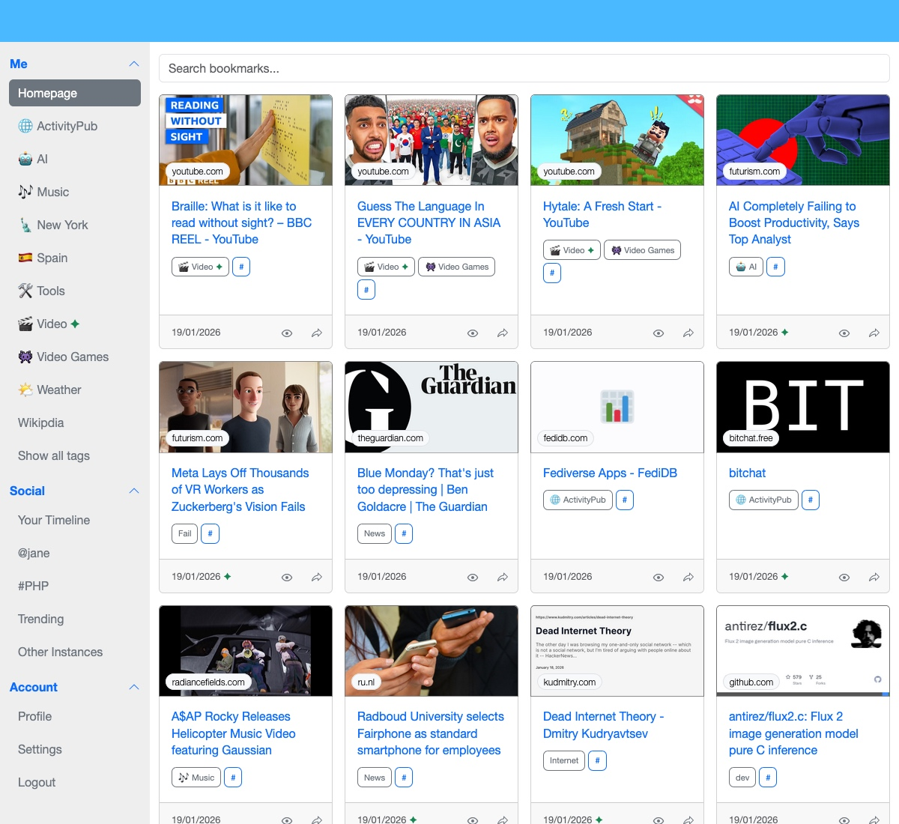
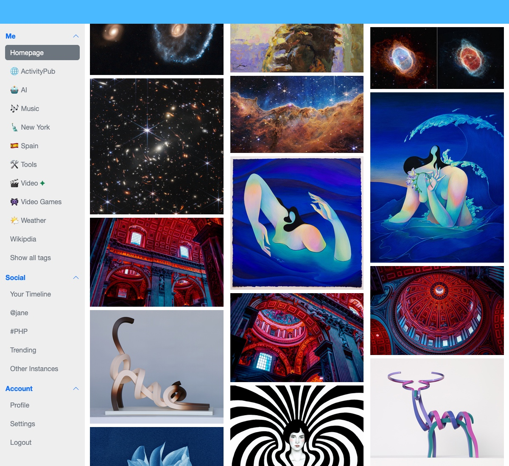
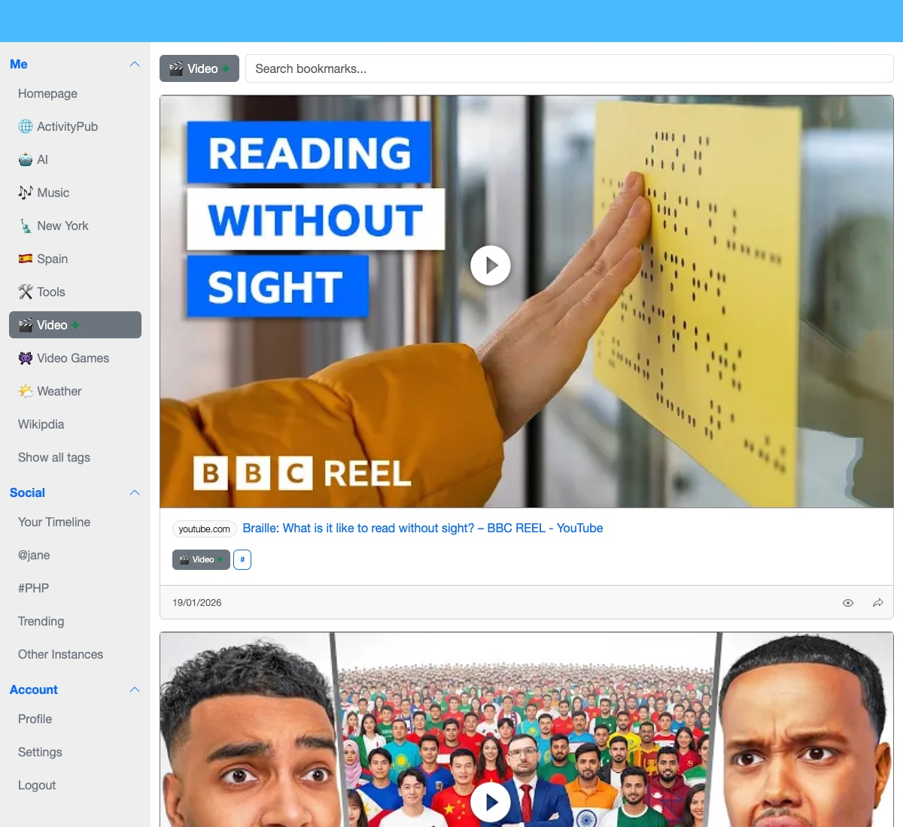

## What is HiveCache?

HiveCache is a decentralized social bookmarking service based on ActivityPub.
Each bookmark includes a snapshot of the page at a specific point in time, ensuring you'll always have access to the version you bookmarked even if the original disappears.

  
  
  

## Philosophy

HiveCache promotes human curation over algorithmic feeds, preserves web content for future reference,
and empowers users with control over their data through decentralization.

## Key Features

- **Easy**: At its core, HiveCache is an easy Bookmarking service
- **Tags**: Flexible tagging with custom layouts
- **Archive**: Save pages and archive them as `gz` files (readable in any browser)
- **Privacy Controls**: Public and private bookmarks (end-to-end encryption coming soon)
- **Social**: Follow users and discover bookmarks across instances
- **Decentralized**: Uses ActivityPub protocol for federation between instances

## Next Step

[Read the User Guide →](./UserGuide.md)