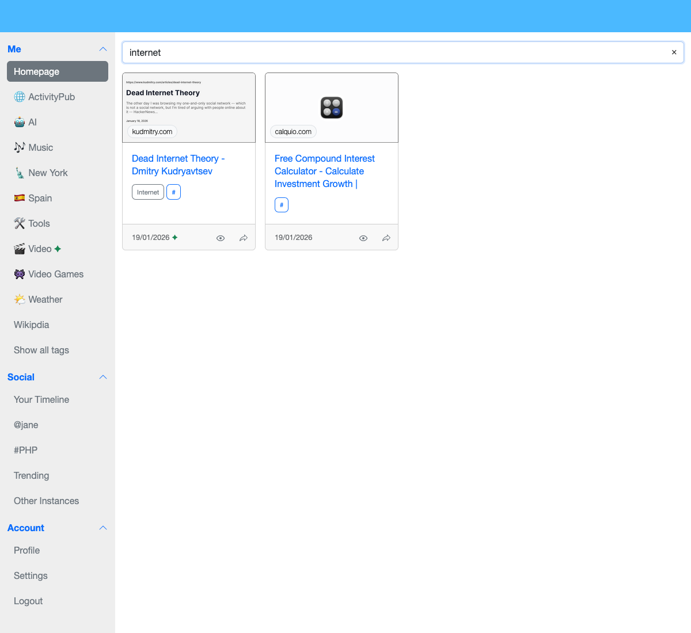
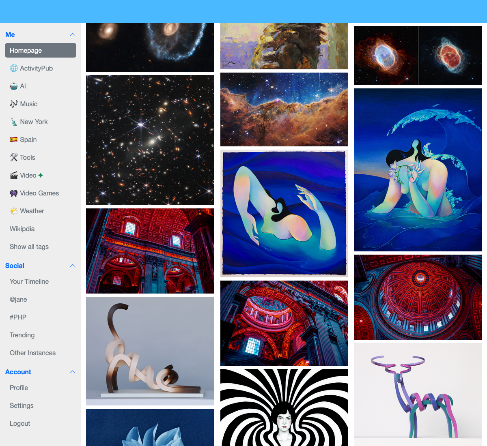
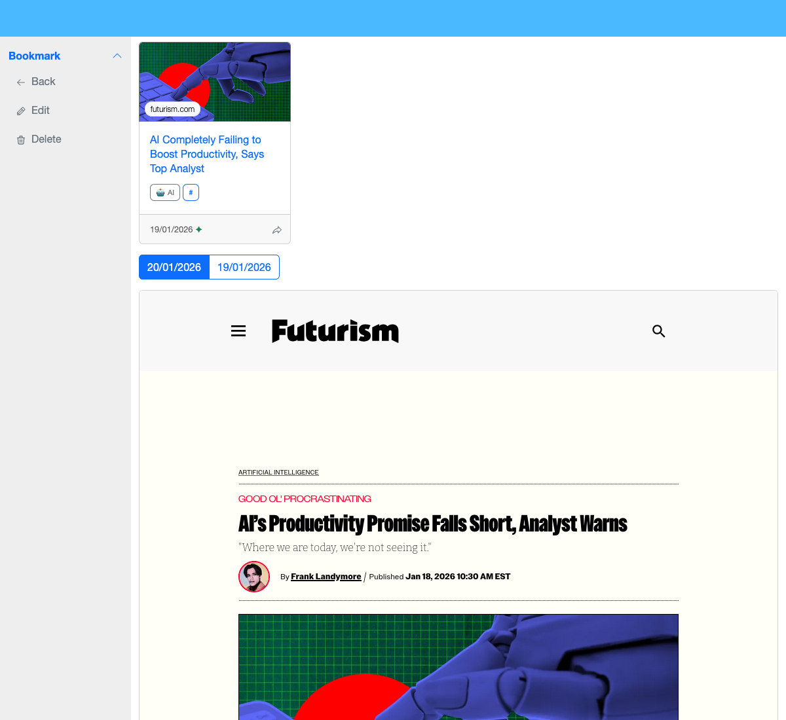
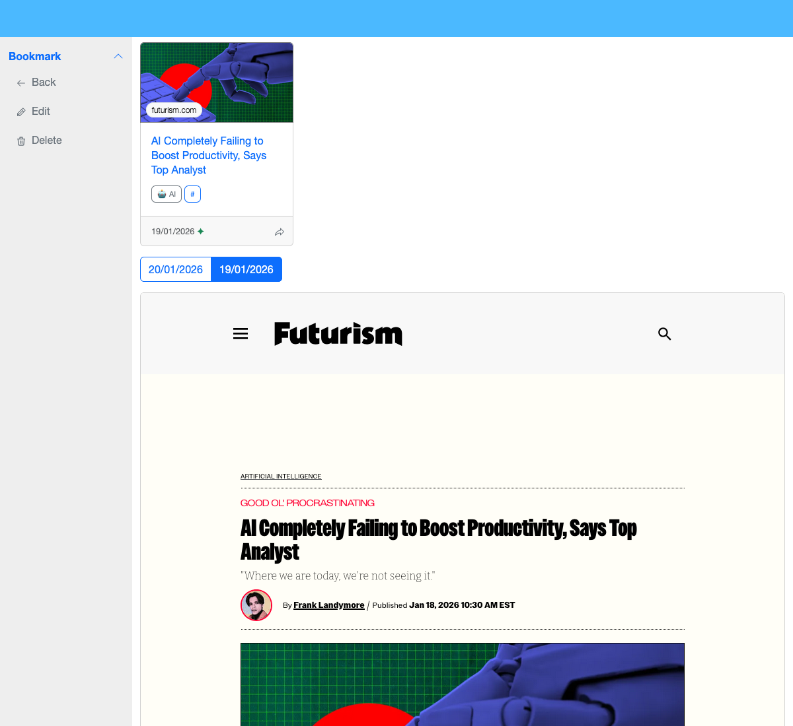
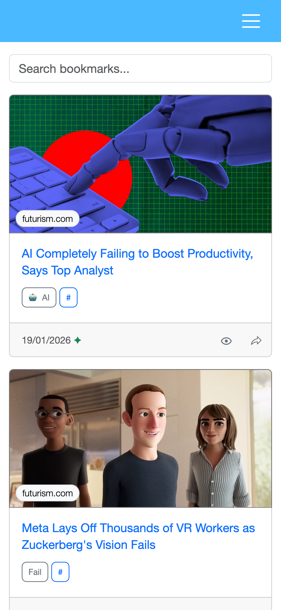

# HiveCache User Guide

## How It Works

### Vocabulary

Bookmark
  : Saved web pages with title, URL, main image, archive snapshot, tags, and visibility settings.

Tag
  : Organize bookmarks with custom tags. Pin important ones, add emoji, use different layouts (default, embedded, image) to your preference.

Following
  : Follow users to see their public bookmarks in your timeline. Following works across different HiveCache instances.

Re-capturing
  : Save bookmarks from your timeline to your own collection.
  : This copies the main image and archive files, creating your own version independent from the original.

### The Bookmarking Flow

1. **Capture**: Use the browser extension to capture a page
2. **Archive**: Page content is automatically archived/cached as a `gz` file
3. **Organize**: Add tags and set visibility (public/private)
4. **Share**: Public bookmarks are shared with followers via ActivityPub
5. **Discover**: Browse your timeline to see bookmarks from people you follow or tags you're interested in

## Screenshots

### Home Page

Homepage showing your own bookmarks and tags.

### Search

Find your bookmarks, either by tags, or with fuzzy search across title, URL, or domain.

### Layouts

HiveCache supports different tag layouts for organizing your bookmarks:

Image-focused layout for visual browsing a bit like Pinterest.

Video layout optimized for media content with embed ready to play.

### History

View bookmark history and versions.

> [!NOTE]
> The archive attached to each bookmark is a real capture, not a frame to the current website.

### Mobile

HiveCache is responsive and works on mobile devices, it has its own icon ready for your homescreen.
